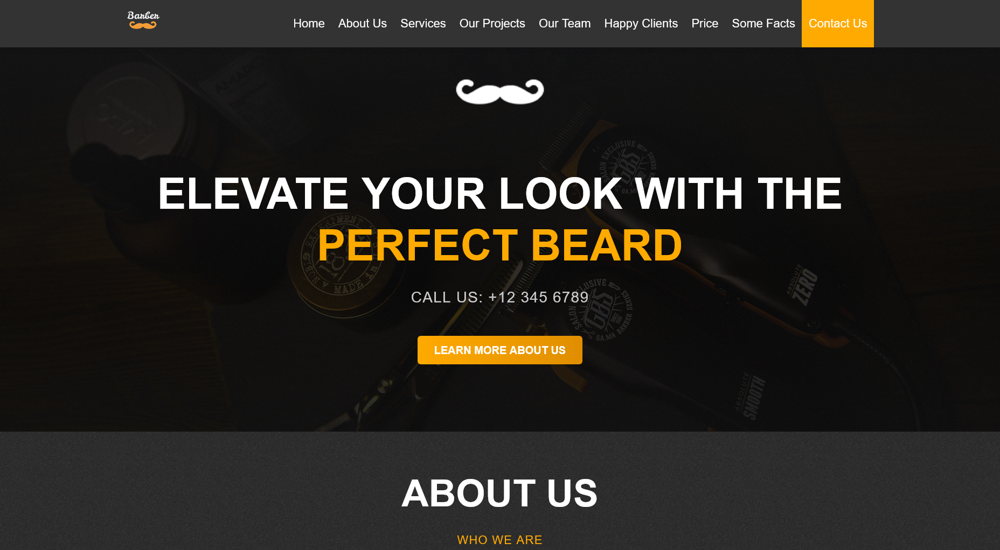

# 💈 Barbershop Website

Responsive landing page for a barbershop.  
Portfolio project to showcase **HTML, CSS, and responsive design skills**.

---

## ✨ Features

- Mobile-first responsive design  
- Clean and semantic HTML  
- Modular CSS structure  
- Fully functional layout for desktop and mobile

---

## 📝 Notes / Disclaimer

- This is a **portfolio project**, created to showcase my layout and responsive design skills.  
- **Images:** I only used the images available; ideally, assets for different screen sizes would be provided, but for simplicity, the same images are used across all views.  
- **Feedback welcome:** I am open to reviews and suggestions to improve this project.

---

## 👀 Preview

  
> *(Replace with the actual path to a screenshot or GIF of your project)*

---

## 📄 License

This project is licensed under the [MIT License](LICENSE).
